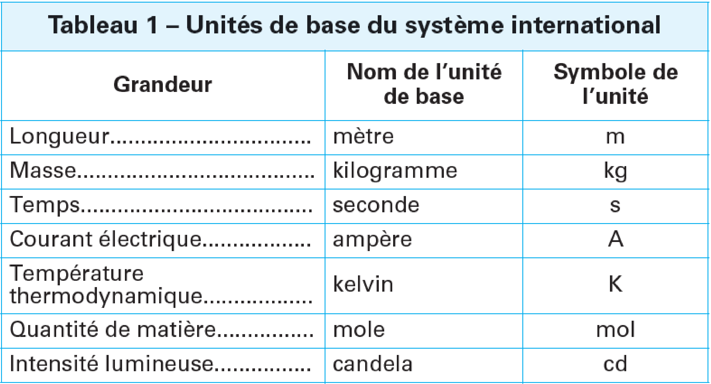

# Mesure d'une grandeur physique

Une **mesure expérimentale** se définit par l'ensemble d'opérations ayant
pour but de déterminer la valeur d'une grandeur physique.

||
|:--:| 
| *in* Technique de l'ingénieur, Unités de mesure S.I., Nicole Legend (2006) |

>*température corporelle d'un individu par un thermomètre infra-rouge
(sans contact) dans le but de déterminer son état de santé.*

La **valeur vraie** est la valeur que l'on obtiendrait si la mesure était
parfaite. La mesure n'étant jamais parfaite, la valeur vraie est
toujours inconnue.

>*la température \"vraie\" du corps n'est pas accessible à l'expérience.
Mais, (i) cette grandeur est-elle bien définie (variation d'un organe à
l'autre, d'un moment à l'autre de la journée, même pour un individu
sain)? (ii) une approximation à quelques dixièmes de degrés près
n'est-elle pas suffisante?*

L'*erreur de mesure* est la différence entre la valeur mesurée et la
valeur vraie:

$$\epsilon = (\textrm{Valeur mesurée}) - (\textrm{Valeur vraie}).$$

L'erreur de mesure est toujours inconnue, au même titre que la valeur
vraie.

La **répétabilité des résultats d'une mesure** représente l'étroitesse de
l'accord entre les résultats des mesures successives d'une même grandeur
physique, lorsque l'expérience est répétée dans les mêmes conditions.

>*série de prises de températures corporelles réalisées dans un court
intervalle de temps, en visant la même zone d'un même individu, suivant
le même angle et à la même distance, avec le même appareil...*

La notion de répétabilité mesure la confiance que l'on peut attribuer à
un résultat de mesure obtenu par une technique expérimentale
particulière.

La **reproductibilité des résultats** de mesure représente quant à elle
l'étroitesse de l'accord entre les résultats de la mesure d'une même
grandeur physique, dans les mêmes conditions, mais dans un *cadre*
différent (autre laboratoire, autre expérimentateur, autre
appareil\...).

La notion de reproductibilité mesure la confiance que l'on peut
attribuer à une technique expérimentale pour obtenir des résultats
fiables. C'est un critère plus fort que la répétabilité.

Le **résultat de la mesure** est la valeur représentative de toutes les
mesures réalisées au cours de l'expérience ( une moyenne) à laquelle
s'ajoute l'incertitude expérimentale.

> par exemple $T = 37.2 \pm 0.1\,^\circ$ C

L'*incertitude de mesure* est le paramètre qui caractérise la dispersion
des valeurs mesurées. C'est la part de doute de contenue dans la mesure.
